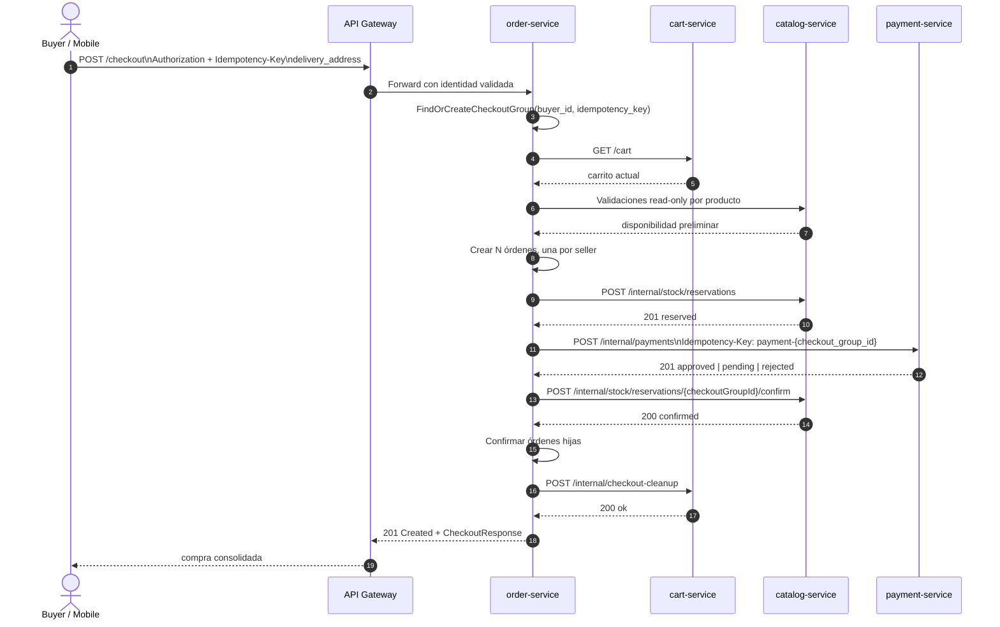
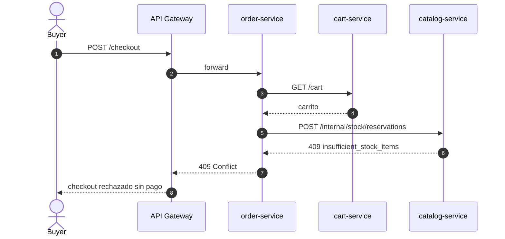
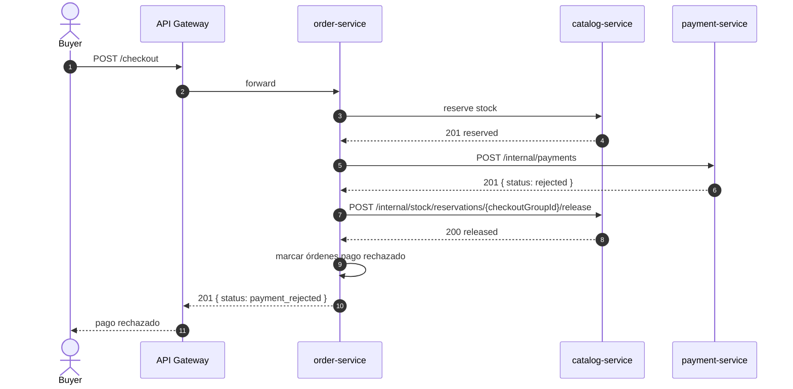
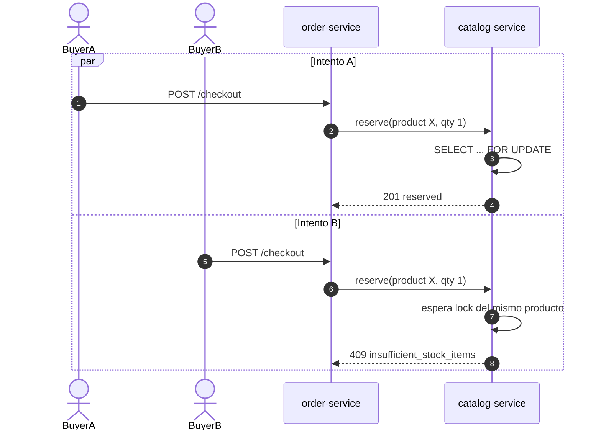
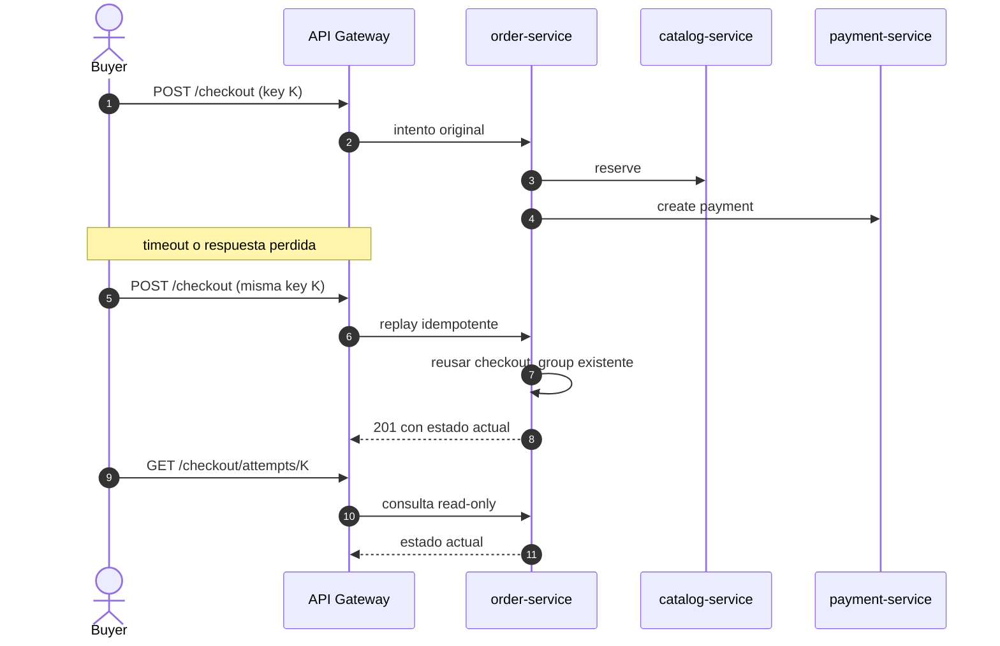

# Checkout Saga

Documentación verificada contra la implementación real en:

- `bazaar-platform`
- `bazaar-backend-order-service`
- `bazaar-backend-catalog-service`
- `bazaar-backend-payment-service`
- `bazaar-backend-cart-service`
- `Bazaar-backend-api-gateway`
- `bazaar-mobile`
- `bazaar-backoffice`

## Resumen

El checkout de Bazaar está implementado como una Saga orquestada por `order-service`.

- el comprador ve una compra consolidada;
- internamente se crea una orden por vendedor dentro de un `checkout_group_id`;
- el pago es único por `checkout_group_id`;
- el stock se reserva antes de intentar cobrar;
- `confirm` no descuenta stock otra vez: solo confirma una reserva ya descontada;
- el cleanup del carrito no hace `clear all`: resta únicamente las cantidades compradas.

## Alcance E2E real

- El flujo backend real hoy pasa por `API Gateway -> order-service -> cart-service -> catalog-service -> payment-service`.
- `bazaar-mobile` NO tiene checkout integrado end-to-end: `src/app/(tabs)/cart.tsx` renderiza `HomeScreen`, o sea, el tab de carrito es un placeholder.
- `bazaar-backoffice` sigue parcial para órdenes/métricas: `src/services/adminService.ts` usa mocks (`ADMIN_ORDERS`, `ORDERS_EVOLUTION_BARS`).
- Para el TP, el alcance defendible hoy es backend + gateway reales, con frontends todavía parciales para el circuito completo de compra.

## Flujo Feliz

### Notas verificadas

- El comprador ve una sola compra, pero el backend persiste una orden por vendedor.
- `order-service` agrupa todo bajo un único `checkout_group_id`.
- `payment-service` aplica idempotencia por header `Idempotency-Key` y además por `checkout_group_id`.
- `catalog-service` descuenta stock en `reserve`; `confirm` solo cambia `reserved -> confirmed`.
- `cart-service` limpia cantidades compradas por `product_id`; si el usuario volvió a agregar el mismo producto durante el checkout, solo se resta lo comprado.
- `POST /checkout` responde `201 Created`, incluso cuando el request es un replay con la misma `Idempotency-Key`.

## Flujos Alternativos Obligatorios

### 1. Stock insuficiente

El checkout falla antes del pago.

- `order-service` obtiene carrito y arma el intento.
- `catalog-service` rechaza `POST /internal/stock/reservations` con `409`.
- `payment-service` NO es llamado.
- el carrito queda intacto;
- el frontend recibe `409 Conflict`.

Observación importante:
La implementación real ya puede haber creado el `checkout_group` y las órdenes hijas antes del intento de reserva. Lo que NO ocurre es el pago ni una compra confirmada visible.

### 2. Pago rechazado

El rechazo es un resultado de negocio, no un `HTTP 402`.

- el stock ya estaba reservado;
- `payment-service` responde `201` con body `status: "rejected"`;
- `order-service` libera la reserva con `POST /internal/stock/reservations/{checkoutGroupId}/release`;
- las órdenes quedan en `pago rechazado`;
- el carrito queda intacto;
- el `CheckoutResponse` vuelve con `status: "payment_rejected"`.

### 3. Concurrencia por último ítem

La protección real está en `catalog-service`, no en el chequeo preliminar de disponibilidad.

- dos buyers pueden pasar `validateAvailability` al mismo tiempo;
- `catalog-service` ordena `product_id` y lockea filas con `SELECT FOR UPDATE`;
- uno reserva y descuenta stock;
- el otro espera el lock y luego recibe `409`;
- no hay doble venta del último ítem.

### 4. Retry por timeout

Con la misma `Idempotency-Key` no se duplican órdenes, stock ni pago.

- `order-service` resuelve el mismo `checkout_group_id` por `(buyer_id, idempotency_key)`;
- si ya había órdenes, reanuda o devuelve el estado actual;
- `catalog-service` es idempotente por `checkout_group_id`;
- `payment-service` es idempotente por header y por `checkout_group_id`;
- el frontend puede reconciliar con:
  - `GET /checkout/attempts/:idempotencyKey`
  - `GET /checkout-groups/:checkoutGroupId`

## Matriz Contra Enunciado Del TP

| Criterio del enunciado | Cómo se resuelve | Endpoint/servicio | Estado | Observaciones |
|---|---|---|---|---|
| checkout exitoso | Saga orquestada: carrito -> reserva -> pago -> confirmación -> cleanup | `POST /checkout`, `order-service`, `catalog-service`, `payment-service`, `cart-service` | Implementado | respuesta `201`; una compra visible, N órdenes por seller |
| pago rechazado | rechazo en body del payment + release de stock + órdenes `pago rechazado` | `POST /internal/payments`, `POST /internal/stock/reservations/{id}/release` | Implementado | no usa `HTTP 402` |
| stock insuficiente | reserva transaccional all-or-nothing corta el flujo antes del pago | `POST /internal/stock/reservations` | Implementado | `409`; carrito intacto; payment no se llama |
| carrera por último ítem | lock pesimista con `SELECT FOR UPDATE` y orden estable por `product_id` | `catalog-service` | Implementado | evita doble venta |
| idempotencia | unique `(buyer_id, idempotency_key)`, unique `checkout_group_id`, unique cleanup op | `order-service`, `payment-service`, `catalog-service`, `cart-service` | Implementado | replay de `POST /checkout` sigue devolviendo `201` |
| dirección obligatoria | binding requerido sobre `delivery_address` | `CheckoutRequest` en `order-service` | Implementado | `delivery_city` y `delivery_province` son opcionales |
| multi-vendedor | un `checkout_group_id`, una orden por `seller_id`, un pago único | `order-service` | Implementado | decisión base de ADR 0008 |
| visibilidad seller/admin/buyer | buyer ve su compra; seller ve solo sus órdenes; admin ve lectura global | gateway + `order-service` | Implementado | `GET /checkout-groups/:id` es buyer/admin; seller no accede |

## Estado Real Vs Pendiente

| Tema | Estado | Detalle verificado |
|---|---|---|
| `POST /checkout` | Implementado pero mal documentado | controller real devuelve `201 Created`, no `200` |
| `POST /checkout/quote` | Implementado parcialmente | funciona y es read-only; `coupon_code` todavía se rechaza |
| stock `reserve/confirm/release` | Implementado pero mal documentado | `reserve` descuenta; `confirm` no descuenta; `release` solo restaura si estaba `reserved` |
| cleanup de carrito | Implementado pero mal documentado | endpoint real `POST /internal/checkout-cleanup`; body `buyer_id`, `checkout_group_id`, `items[]`; idempotencia por tabla `cart_cleanup_operations` |
| payment rejected | Implementado pero mal documentado | rechazo va en body `status: rejected` con `201`; no `HTTP 402` |
| estados reales de pago | Implementado | `pending`, `approved`, `rejected`, `refund_pending`, `refunded`, `refund_failed`, `preference_failed` |
| refund técnico en payment-service | Implementado | `RefundPayment` puede completar `approved -> refund_pending -> refunded` y notifica a `order-service` por callback |
| refund automático desde order-service | Implementado parcialmente | la arquitectura lo contempla, pero `order-service` no tiene hoy una integración runtime cableada para dispararlo automáticamente en checkout/cancelación |
| buyer `GET /orders?status=` | Implementado pero mal documentado | el filtro por estado sí existe en controller y repository |
| mobile checkout E2E | Pendiente | el tab `cart` es placeholder y no ejecuta checkout real |
| backoffice órdenes E2E | Pendiente | `adminService.ts` mantiene órdenes/métricas sobre mocks |
| OpenAPI manual del order-service | Implementado pero mal documentado | tenía drift en request names, códigos HTTP, cleanup, quote y contratos internos |

## Rutas Verificadas En Gateway

`Bazaar-backend-api-gateway` enruta estas superficies a `order-service`:

- `/checkout`
- `/checkout-groups/`
- `/orders/`
- `/seller/orders/`
- `/admin/orders/`

Esto coincide con `internal/config/config.go` del gateway. Las rutas `/internal/*` no pasan por el gateway.

## Decisiones Defendibles Para El TP

- La compra visible del comprador y las órdenes operativas por vendedor están separadas.
- La consistencia distribuida se resuelve con Saga orquestada, no con 2PC.
- La concurrencia crítica del último ítem se resuelve en el servicio dueño del stock.
- La idempotencia está resuelta por claves de negocio y constraints persistentes, no solo por convención de frontend.
- El estado E2E real hoy es principalmente backend; frontend mobile y backoffice todavía tienen partes mockeadas o no integradas.
